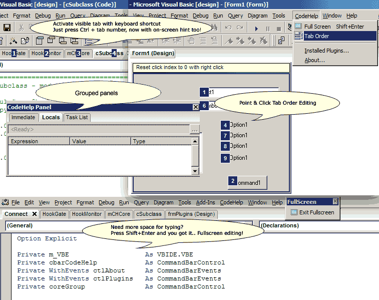



## CodeHelp Add\-In 2\.2 \(Updated Again, plus new CHCoder plugin\)

### Description

CodeHelp is an addin framework that allow enhancement to the way VB IDE works.

Updated version 2.2, includes new plugin, and added features.

Tested on WinXP. Please read included readme.txt for compile instructions and remember to uninstall any previous version first.

You can also download setup file from http://codehelp.cjb.net.
 
### More Info
 
WinAPIForVB type library from

http://www.planet-source-code.com/vb/scripts/ShowCode.asp?txtCodeId=62060&amp;lngWId=1

             |
---                |---
**Submitted On**   |2005-09-26 06:03:36
**By**             |[Luthfi M](https://github.com/Planet-Source-Code/PSCIndex/blob/master/ByAuthor/luthfi-m.md)
**Level**          |Advanced
**User Rating**    |5.0 (184 globes from 37 users)
**Compatibility**  |VB 6\.0
**Category**       |[VB function enhancement](https://github.com/Planet-Source-Code/PSCIndex/blob/master/ByCategory/vb-function-enhancement__1-25.md)
**World**          |[Visual Basic](https://github.com/Planet-Source-Code/PSCIndex/blob/master/ByWorld/visual-basic.md)
**Archive File**   |[CodeHelp\_A1935969282005\.zip](https://github.com/Planet-Source-Code/luthfi-m-codehelp-add-in-2-2-updated-again-plus-new-chcoder-plugin__1-62468/archive/master.zip)

